# Architecture Research

**Domain:** Multi-tenant SaaS para gestão de grandes eventos (espaços/stands + ingressos + bebidas + prestadores) — mercado BR/LGPD
**Researched:** 2026-06-11
**Confidence:** HIGH (multi-tenancy + queue + reverse-proxy verificados via Context7; padrões de reserva via consenso documentado da indústria)

---

## Executive Summary

FB_EVENTOS é um **monolito modular Go + React + PostgreSQL** com decomposição por capacidade de negócio (12 módulos), multi-tenancy via **shared schema + Row-Level Security (RLS)** com `tenant_id` derivado do JWT, roteamento por **path-based** (`fbeventos.com/{tenant_slug}`) no v1 com migração para **subdomínio wildcard** (`{tenant}.fbeventos.com`) quando white-label entrar, fila de trabalho assíncrono **Postgres-nativa** (River v0.x para Go), reservas de lote com **advisory locks transacionais** (`pg_advisory_xact_lock`) e atualizações em tempo real via **Server-Sent Events (SSE)** unidirecionais.

**Por que isso e não outra coisa:**
1. **Monolito modular > microsserviços**: solo-dev + 3 meses até piloto = velocidade de deploy + zero overhead operacional. Módulos com fronteiras explícitas permitem decompor depois sem reescrever.
2. **Shared schema + RLS > schema-per-tenant > db-per-tenant**: 900k atendentes do piloto cabem em um schema único; RLS evita refactor doloroso quando chegarem 10/100/1000 organizadoras; isolamento via `SET LOCAL app.current_tenant_id` é defensivo em profundidade contra bugs de query.
3. **PostgreSQL faz tudo (storage + queue + locks + pub/sub)**: alinhado à constraint contratual ("PostgreSQL único source-of-truth"), evita Redis/SQLite/RabbitMQ no v1, simplifica backup/restore/observabilidade.
4. **FB_APU04 reaproveita-se na infra (Docker/Coolify/Traefik/Prometheus), não no domínio**: a stack de operação está validada; o domínio (fiscal vs eventos) é totalmente diferente.

---

## Standard Architecture

### System Overview (high-level)

```
┌────────────────────────────────────────────────────────────────────────────────┐
│                              Internet / Browser / App                           │
└──────────────────────┬─────────────────────────────────────────────────────────┘
                       │ HTTPS + TLS
                       ▼
┌────────────────────────────────────────────────────────────────────────────────┐
│  Edge — Traefik (TLS, ACME wildcard, rate limit, host routing)                  │
│  Routes:                                                                        │
│    Host(`fbeventos.com`)              → web (marketing + tenant signup)         │
│    Host(`app.fbeventos.com`)          → web (organizadora console)              │
│    HostRegexp(`{t:[a-z0-9-]+}.fbeventos.com`) → web (white-label tenants)       │
│    PathPrefix(`/api`)                 → api                                     │
│    PathPrefix(`/events/`)             → web (marketplace público)               │
└──────────────────────┬─────────────────────────────────────────────────────────┘
                       │ HTTP/JSON, SSE long-lived streams
                       ▼
┌────────────────────────────────────────────────────────────────────────────────┐
│  Tier 1 — Frontend (React 18 + Vite SPA, build estática servida por nginx)      │
│  Single binary; routing decide UI (organizadora vs fornecedor vs marketplace).  │
│  Camada de fetch injeta Authorization + X-Tenant-Slug (de host) automaticamente.│
└──────────────────────┬─────────────────────────────────────────────────────────┘
                       │
                       ▼
┌────────────────────────────────────────────────────────────────────────────────┐
│  Tier 2 — Backend API (Go, single binary, monolito modular)                     │
│                                                                                 │
│  ┌─────────┐ ┌──────────┐ ┌─────────┐ ┌─────────┐ ┌─────────┐ ┌────────────┐  │
│  │identity │ │ tenancy  │ │ events  │ │floorplan│ │ vendors │ │  tickets   │  │
│  └─────────┘ └──────────┘ └─────────┘ └─────────┘ └─────────┘ └────────────┘  │
│  ┌─────────┐ ┌──────────┐ ┌─────────┐ ┌─────────┐ ┌──────────┐ ┌───────────┐  │
│  │   fnb   │ │ staffing │ │payments │ │ billing │ │compliance│ │integrations│ │
│  └─────────┘ └──────────┘ └─────────┘ └─────────┘ └──────────┘ └───────────┘  │
│                                                                                 │
│  Cross-cutting: middleware (auth, RLS context, audit), worker (River jobs)      │
└──────┬────────────────────────┬────────────────────────┬───────────────────────┘
       │                        │                        │
       ▼                        ▼                        ▼
┌────────────────┐     ┌───────────────────┐    ┌──────────────────────┐
│ PostgreSQL 16  │     │ Object Storage     │    │ External Gateways    │
│ ─ schema único │     │ S3-compatible      │    │ Pagar.me / MP / PIX  │
│ ─ RLS por      │     │ MinIO no dev,      │    │ Sympla / Eventbrite  │
│   tenant_id    │     │ Cloudflare R2 ou   │    │ SendGrid / Resend    │
│ ─ River queue  │     │ AWS S3 em prod     │    │ Receita Federal CNPJ │
│ ─ Outbox table │     │ (PDFs, plantas,    │    │                      │
│ ─ Audit log    │     │  uploads, QRs)     │    │ (todos via outbound  │
│ ─ Advisory     │     │                    │    │  HTTPS; webhooks     │
│   locks        │     │                    │    │  entram pelo Traefik)│
└────────────────┘     └───────────────────┘    └──────────────────────┘
       ▲
       │ Read replicas (Phase 4 — quando marketplace público escalar)
       │
┌────────────────┐
│ PG Read        │
│ Replica(s)     │
│ (somente       │
│  marketplace,  │
│  catálogo)     │
└────────────────┘

  Observability sidecar (cargas FB_APU04 reaproveitadas):
  ┌────────────┐  ┌────────────┐  ┌──────────────┐  ┌──────────────┐
  │ Prometheus │  │  Grafana   │  │ Alertmanager │  │ Loki (logs)  │
  └────────────┘  └────────────┘  └──────────────┘  └──────────────┘
```

### Reference Diagram (Mermaid)

```mermaid
flowchart TB
  subgraph Edge["Edge / Reverse Proxy"]
    Traefik[Traefik<br/>TLS + wildcard ACME<br/>rate limit + host routing]
  end

  subgraph Web["Frontend (React 18 SPA - static)"]
    OrgUI[Organizadora Console]
    VendorUI[Fornecedor Portal]
    StaffUI[Prestador Portal]
    PublicUI[Marketplace Publico]
  end

  subgraph API["Backend Go (single binary, modular monolith)"]
    direction TB
    Identity[identity<br/>auth + RBAC + JWT]
    Tenancy[tenancy<br/>org provisioning + white-label]
    Events[events<br/>event setup + venues]
    Floorplan[floorplan<br/>planta + lotes + m2 + locking]
    Vendors[vendors<br/>cadastro + contratos]
    Tickets[tickets<br/>checkout + check-in]
    FnB[fnb<br/>POS bebidas/comida]
    Staffing[staffing<br/>mao de obra + comissao]
    Payments[payments<br/>PIX/Cartao + splits + refunds]
    Billing[billing<br/>assinatura + comissao]
    Compliance[compliance<br/>LGPD + audit + retencao]
    Integrations[integrations<br/>Sympla/Eventbrite/contabil]
    Worker[worker pool<br/>River jobs]
  end

  subgraph Data["Persistence"]
    PG[(PostgreSQL 16<br/>shared schema + RLS)]
    PGRep[(PG Read Replica<br/>marketplace catalog)]
    S3[(Object Storage<br/>S3-compatible)]
  end

  subgraph Ext["External"]
    Gateway[Payment Gateway<br/>Pagar.me / MP / Stripe BR]
    Sympla[Sympla / Eventbrite]
    Email[Email Provider]
    CNPJ[Receita Federal]
  end

  Traefik --> OrgUI & VendorUI & StaffUI & PublicUI
  OrgUI & VendorUI & StaffUI & PublicUI --> Traefik
  Traefik --> API

  Identity --> PG
  Tenancy --> PG
  Events --> PG
  Floorplan --> PG
  Vendors --> PG
  Tickets --> PG
  FnB --> PG
  Staffing --> PG
  Payments --> PG
  Billing --> PG
  Compliance --> PG
  Integrations --> PG
  Worker --> PG

  PG -.replication.-> PGRep
  PublicUI -.read-only.-> PGRep

  Floorplan -.upload PDF/SVG.-> S3
  Tickets -.QR codes + receipts.-> S3
  Vendors -.contratos PDF.-> S3

  Payments <-->|PIX/Card + webhooks| Gateway
  Integrations <-->|sync ingressos| Sympla
  Compliance -.lookup CNPJ.-> CNPJ
  Worker -.transactional outbound.-> Email
```



### Component Responsibilities

| Módulo | Responsabilidade (o que possui) | Tabelas principais | Comunica com |
|--------|----------------------------------|--------------------|---------------|
| **identity** | Usuários, sessão, JWT, MFA, RBAC, roles persona-scoped (organizadora_admin, fornecedor, prestador, publico) | `users`, `roles`, `user_roles`, `sessions`, `refresh_tokens` | tenancy (claims) |
| **tenancy** | Provisionamento de organização (tenant), domínio custom, white-label config (logo, cores), slug | `tenants`, `tenant_domains`, `tenant_branding`, `tenant_subscription_status` | identity (signup) |
| **events** | Cadastro de eventos, datas, locais, equipe organizadora | `events`, `event_team`, `venues` | tenancy, identity |
| **floorplan** | Upload de planta (PDF/SVG/img), mapeamento de zonas/lotes, pricing por m², regras categoria/restrição, **reservas com lock** | `floorplans`, `zones`, `lots`, `lot_reservations`, `lot_pricing_rules` | events, vendors (consumidor), payments (libera após pagar) |
| **vendors** | Cadastro de fornecedor/patrocinador, KYC (CNPJ via Receita), aprovação, contratos digitais, portal self-service | `vendors`, `vendor_kyc_documents`, `vendor_contracts`, `vendor_event_participations` | events, floorplan, payments, compliance (LGPD), integrations (CNPJ) |
| **tickets** | Tipos de ingresso, lotes, carrinho, checkout, emissão de QR, check-in (PWA scanner) | `ticket_types`, `tickets`, `ticket_orders`, `ticket_checkins` | events, payments, integrations (Sympla sync) |
| **fnb** | Cardápio, estoque por ponto, POS no dia do evento, vendas, fechamento | `fnb_menus`, `fnb_items`, `fnb_orders`, `fnb_cash_sessions` | events, payments |
| **staffing** | Cadastro de prestadores, demandas, escalas, controle de horas, comissão da plataforma | `staffing_workers`, `staffing_assignments`, `staffing_shifts`, `staffing_payouts` | events, billing (comissão) |
| **payments** | Cobranças (PIX/cartão), splits (organizadora vs plataforma), webhooks, refunds, state machine de transação | `payments`, `payment_webhooks_inbox`, `payment_splits`, `refunds` | vendors (libera lot), tickets (libera QR), fnb, staffing, billing, integrations (gateway) |
| **billing** | Assinatura mensal da organizadora, geração de fatura de comissão sobre transações, cobrança recorrente | `subscriptions`, `commission_invoices`, `subscription_charges` | payments, tenancy |
| **compliance** | Consentimentos LGPD, log de auditoria imutável, retenção/expurgo, atendimento de direito ao esquecimento | `consents`, `audit_log`, `data_retention_policies`, `dsr_requests` | todos (audit hook via middleware) |
| **integrations** | Conectores externos (Sympla, Eventbrite, ERPs futuros), webhooks, retry, mapeamento de IDs | `integration_configs`, `integration_sync_jobs`, `external_id_mappings` | tickets, vendors, billing |

---

## Multi-Tenancy Strategy — Decisão

### Comparação direta

| Estratégia | Isolamento | Custo operacional (1→1000 tenants) | DX | Performance | Backup/restore por tenant | LGPD direito ao esquecimento | Veredito |
|------------|------------|-------------------------------------|----|------------|---------------------------|------------------------------|----------|
| **Shared schema + RLS** | Lógico (policy obriga `tenant_id` em todo SELECT/UPDATE/DELETE) | Baixo — 1 DB, 1 schema, índices compostos `(tenant_id, …)` | Alto — uma migration vale para todos | Excelente até ~10⁹ linhas por tabela com particionamento opcional | Médio — requer dump com WHERE | Médio — DELETE em cascata por `tenant_id` é trivial | **ESCOLHIDO** |
| Schema-per-tenant | Forte (PostgreSQL schema isolation) | Alto — `N×M` migrations, `search_path` por request, connection pool fica complexo | Médio — DDL precisa rodar em cada schema | Boa, mas catálogo do Postgres fica gigantesco com >500 schemas | Bom — `pg_dump --schema=tenant_x` | Bom — `DROP SCHEMA tenant_x CASCADE` | Não. Custo de manutenção mata solo dev. |
| Database-per-tenant | Máximo | Proibitivo — N clusters, N conexões, observabilidade fragmentada | Ruim — provisioning vira projeto à parte | Boa, isolamento de noisy neighbor | Excelente — backup é o próprio DB | Excelente — DROP DATABASE | Não. Reservado para tenants enterprise com SLA dedicado (v2+, opt-in pago). |
| Híbrido (shared hot + per-tenant archive) | Misto | Médio | Médio | Boa | OK | OK | Não no v1. Considerar quando 1 tenant > 50% do volume. |

### Recomendação: **Shared schema + Row-Level Security (RLS) com `tenant_id` em toda tabela de domínio**

**Por quê — argumentação técnica:**

1. **Solo dev + 3 meses**: schema-per-tenant exige um runner de migration que itera tenants — código novo, novo bug surface. RLS exige escrever a policy uma vez por tabela e o resto é gratis.
2. **Piloto = 1 tenant gigante (900k público)**: a dimensão crítica é "uma organizadora com muita transação", não "muitas organizadoras pequenas". RLS escala bem nesse perfil.
3. **LGPD cascade**: `DELETE FROM users WHERE tenant_id = $1` toca todas as tabelas dependentes via `ON DELETE CASCADE` (com FK em `tenant_id`). Schema-per-tenant é mais fácil para "esquecer tenant inteiro", mas `tenant_id` particionado também resolve.
4. **Constraint contratual** (PostgreSQL único): RLS é nativo do Postgres, não introduz componentes novos.
5. **Padrão validado em produção**: Supabase (multi-tenant SaaS aberto) usa exatamente esse padrão; AWS Aurora documenta como recomendado para a maioria dos casos; Linear, Vercel, PostHog seguem variantes.

**Como implementar (concreto):**

```sql
-- 1. Toda tabela de domínio tem tenant_id NOT NULL com FK
CREATE TABLE events (
    id            UUID PRIMARY KEY DEFAULT gen_random_uuid(),
    tenant_id     UUID NOT NULL REFERENCES tenants(id) ON DELETE CASCADE,
    name          TEXT NOT NULL,
    starts_at     TIMESTAMPTZ NOT NULL,
    -- ...
    created_at    TIMESTAMPTZ NOT NULL DEFAULT now()
);

-- 2. Índices compostos: tenant_id SEMPRE primeiro
CREATE INDEX events_tenant_starts_idx ON events (tenant_id, starts_at DESC);

-- 3. Habilita RLS
ALTER TABLE events ENABLE ROW LEVEL SECURITY;
ALTER TABLE events FORCE ROW LEVEL SECURITY;  -- também aplica ao owner da tabela

-- 4. Policy: tenant_id do registro deve casar com session var
CREATE POLICY events_tenant_isolation ON events
    USING (tenant_id = current_setting('app.current_tenant_id')::uuid)
    WITH CHECK (tenant_id = current_setting('app.current_tenant_id')::uuid);
```

```go
// 5. Middleware seta a session var POR REQUEST (não por conexão)
func TenantContextMiddleware(next http.Handler) http.Handler {
    return http.HandlerFunc(func(w http.ResponseWriter, r *http.Request) {
        claims := r.Context().Value(ClaimsKey).(*Claims)
        tenantID := claims.TenantID

        tx, err := db.BeginTx(r.Context(), nil)
        // ...
        // SET LOCAL é escopo de transação — não vaza para outra request na mesma conn
        _, err = tx.ExecContext(r.Context(),
            "SELECT set_config('app.current_tenant_id', $1, true)", tenantID.String())

        ctx := context.WithValue(r.Context(), TxKey, tx)
        next.ServeHTTP(w, r.WithContext(ctx))
        tx.Commit()
    })
}
```

**Verificação Context7 — Supabase RLS pattern** (HIGH confidence):
> ```sql
> create policy "Only allow read-write access to tenants" on tablename as restrictive to authenticated using (
>   tenant_id = (select auth.jwt() -> 'app_metadata' ->> 'provider')
> );
> ```
> Source: github.com/supabase/supabase/apps/www/_blog/2023-04-13-supabase-auth-sso-pkce.mdx

**Pegadinhas a evitar (catalogadas em PITFALLS.md):**
- `BYPASSRLS` em usuário de app — proibido. Apenas usuário de migração tem.
- Conexões compartilhadas no pool sem `SET LOCAL` (precisa estar dentro de transação).
- `JOIN` cruzando tabelas sem RLS — toda tabela de domínio tem RLS, sem exceção.
- Funções `SECURITY DEFINER` que rodam fora do contexto do tenant — auditá-las uma a uma.

### Para tenants enterprise (v2+, opt-in)
Quando um tenant pagar SLA dedicado, oferecer **database-per-tenant** como upgrade: provisionar cluster PG separado, replicar schema, ajustar string de conexão por slug. Não construir no v1 — apenas reservar o ponto de extensão.

---

## Subdomain / Path Routing — Decisão

| Estratégia | Prós | Contras | Quando |
|------------|------|---------|--------|
| **Path-based** `fbeventos.com/{tenant}` | 1 cert TLS, 1 host, simples no Traefik, dev local fácil (`localhost/acme`) | URLs feias para white-label; cookies compartilhados (precisa scope cuidadoso); SEO de marketplace mistura tenants | **Phase 1–3 (interno)** |
| **Subdomínio** `{tenant}.fbeventos.com` | URLs limpas, isolamento de cookies por subdomínio, identidade visual mais forte | Precisa cert wildcard (DNS-01 challenge), DNS dinâmico no provisioning | **Phase 4 (público + white-label)** |
| **Custom domain** `eventos.cliente.com` | White-label completo, parecem nativos do cliente | Cliente precisa adicionar CNAME, ACME por domínio individual (HTTP-01), processo de onboarding ganha um passo | **Phase 4+ (tier pago premium)** |

**Recomendação:**
- **v1 (Phase 1–3):** path-based. URLs: `app.fbeventos.com/{tenant}/eventos`, `app.fbeventos.com/{tenant}/fornecedores`.
- **v2 (Phase 4):** habilitar subdomínio wildcard via Traefik `HostRegexp(`{tenant:[a-z0-9-]+}.fbeventos.com`)` + Let's Encrypt DNS-01 challenge para `*.fbeventos.com`.
- **v3:** suportar domínio custom via tabela `tenant_domains` + ACME on-demand pelo Traefik.

**Verificação Context7 — Traefik** (HIGH confidence):
> Wildcard subdomain matching: `Host(\`*.example.com\`)` em v3 ou `HostRegexp(\`^([^.]+)\\.example\\.com$\`)`. DNS-01 challenge é necessário para wildcard cert.

**Detecção do tenant no backend:**

```go
// Ordem de precedência:
// 1. Custom domain (lookup em tenant_domains.host = r.Host)
// 2. Subdomain (parse de {tenant}.fbeventos.com)
// 3. Path prefix (/api/t/{tenant}/...)
// 4. Falha → 404 com mensagem genérica
```

---

## Service Decomposition — Decisão: Monolito Modular

### Comparação

| Arquitetura | Velocidade dev | Operação | Refactor cost | Recomendação |
|-------------|---------------|----------|---------------|--------------|
| Monolito espaguete | Alta no D1, baixa no D90 | Trivial | Doloroso | Não |
| **Monolito modular** | Alta sustentável | Trivial (1 binário, 1 deploy, 1 log stream) | Médio (extrair módulo é viável) | **SIM** |
| Microsserviços | Baixa no D1 (overhead), depende da equipe | Custosa (N pipelines, N DBs, observabilidade distribuída) | Caro | Não no v1, não com solo dev |

### Regras de fronteira entre módulos (enforcement)

1. **Cada módulo possui suas tabelas.** Outro módulo NÃO faz `SELECT` direto — chama a API pública do módulo dono.
2. **Pasta `backend/modules/{nome}/`** com sub-pastas:
   ```
   backend/modules/floorplan/
     ├── http.go          # handlers HTTP (entrypoint externo)
     ├── service.go       # lógica de negócio
     ├── repository.go    # acesso a tabelas do floorplan
     ├── domain.go        # tipos de domínio + erros tipados
     ├── events.go        # eventos publicados pelo módulo (para outbox)
     └── floorplan_test.go
   ```
3. **Comunicação entre módulos:**
   - **Síncrona**: via interface Go injetada (constructor injection) — `service.go` do módulo A recebe `vendors.Service` como dependência. Lint regra: import de `modules/X/` só vem de `modules/X/` ou do `wire.go` raiz.
   - **Assíncrona**: via tabela `outbox` + River jobs (módulo X grava evento, worker propaga). Veja "Padrões → Outbox".
4. **DB: schemas Postgres separados por módulo dentro do banco único** — opcional, mas ajuda a visualizar fronteiras (`floorplan.lots`, `vendors.vendors`). RLS funciona igual entre schemas.

### Ordem de implementação (build order) por persona

```
Phase 1 (Organizadora) — semanas 1–10
  identity → tenancy → events → floorplan → vendors (admin-side) → payments (admin manual) → compliance (basico) → billing (assinatura)

Phase 2 (Fornecedor) — semanas 11–16
  vendors (portal self-service) → floorplan (selecao + lock) → payments (PIX/cartao + webhooks) → compliance (consents)

Phase 3 (Prestador) — semanas 17–20
  staffing → billing (comissao staffing)

Phase 4 (Publico) — semanas 21+
  tickets → fnb → integrations (Sympla/Eventbrite) → tenancy (white-label) → read replicas
```

**Dependências:**
- `identity` antes de tudo (sem auth nada funciona).
- `tenancy` em paralelo com `identity` (precisa de tenant para todo registro).
- `events` antes de `floorplan` (lote pertence a evento).
- `payments` precisa estar pronto antes de Phase 2 entrar (fornecedor self-service paga).
- `compliance` cresce incrementalmente — começa como middleware de audit + tabela `consents`, evolui.

---

## Data Flow — Críticos

### Fluxo 1: Reserva de lote na planta (RACE CONDITION HARD)

**Problema:** dois fornecedores clicam no mesmo lote simultaneamente. Sem cuidado, ambos vão para checkout e ambos pagam. Reembolso + experiência ruim.

**Estratégia escolhida: TTL reservation + `pg_advisory_xact_lock` no commit**

```
Fornecedor A clica lote #42                Fornecedor B clica lote #42 (1s depois)
  │                                          │
  ▼                                          ▼
POST /api/floorplan/lots/42/reserve         POST /api/floorplan/lots/42/reserve
  │                                          │
  ▼                                          ▼
BEGIN TX                                    BEGIN TX
SELECT pg_advisory_xact_lock(               SELECT pg_advisory_xact_lock(
  hashtext('lot:'||event_id||':42'))          hashtext('lot:'||event_id||':42'))
  │ (adquire lock)                            │ (bloqueado, aguarda)
  │                                          │
SELECT status FROM lots WHERE id=42         │
  │ status='available'                       │
UPDATE lot_reservations                      │
  INSERT (lot_id=42, vendor_id=A,            │
          status='held', expires_at=now+15m) │
UPDATE lots SET status='reserved'            │
COMMIT (lock liberado automaticamente)      │
  │                                          ▼
  │                                        (agora vê lot.status='reserved')
  │                                        ROLLBACK → 409 Conflict
  ▼                                          │
200 OK + reservation_id + expires_at         ▼
                                           UI mostra "Lote acabou de ser reservado"
  │
  ▼
Fornecedor A vai para checkout (15 min)
  │
  ▼ paga ──→ webhook payments → state machine "paid"
                                  │
                                  ▼
                             UPDATE lots SET status='sold'
                             UPDATE lot_reservations SET status='confirmed'

  Se NÃO pagar em 15min:
  River job "expire_reservation" (scheduled at created_at+15m):
    BEGIN; SELECT pg_advisory_xact_lock(...);
    IF reservation.status='held' THEN
       UPDATE lots SET status='available';
       UPDATE lot_reservations SET status='expired';
    END IF; COMMIT;
```

**Por que advisory lock + não `SELECT ... FOR UPDATE`?**
- `FOR UPDATE` segura a linha, ok, mas força quem espera a esperar — UX ruim. Advisory lock tem o mesmo efeito mas é mais explícito e libera no `COMMIT`/`ROLLBACK`.
- Advisory lock por chave derivada (`hashtext`) escala melhor que lock de linha quando o lote vira hotspot em prelaunch.
- **Detalhe importante**: `pg_advisory_xact_lock` é "polite" — espera. Para "fail fast" use `pg_try_advisory_xact_lock` (retorna bool) e responda 409 imediato no segundo clique.

**Recomendação concreta:** `pg_try_advisory_xact_lock` (fail-fast) → resposta imediata "lote já está sendo reservado, tente outro".

**Por que NÃO Redis distributed lock?** Violaria a constraint contratual. Postgres advisory lock cobre o caso 100%.

### Fluxo 2: Pagamento (Pagar.me/MP) — state machine + webhook idempotente

```
[Fornecedor: checkout]
        │
        ▼
POST /api/payments/intents
   { reservation_id, amount, method='pix'|'card' }
        │
        ▼
backend (payments module):
  BEGIN TX
  INSERT INTO payments (id, status='pending', external_id=NULL, ...)
  CALL gateway.CreateCharge(amount, method)
    ← returns external_id, pix_qr_code (ou tokenized card flow)
  UPDATE payments SET external_id=..., status='processing'
  COMMIT
        │
        ▼
return { qr_code, payment_id, expires_at }
        │
        ▼
[Fornecedor escaneia QR / confirma cartão]
        │
        ▼
Gateway processa → webhook POST /api/payments/webhooks/{gateway}
        │
        ▼
Webhook handler:
  1. Verifica signature HMAC do gateway (rejeita se inválido)
  2. INSERT INTO payment_webhooks_inbox (id=event_id_do_gateway, payload, received_at)
     -- PK em event_id_do_gateway = idempotente: retry do gateway é no-op
     ON CONFLICT DO NOTHING
  3. Se inseriu (não-duplicate):
     BEGIN TX
     SELECT * FROM payments WHERE external_id=$1 FOR UPDATE
     UPDATE payments SET status='paid'/'failed'/'refunded'
     IF paid AND payment_type='lot_reservation':
       SELECT pg_advisory_xact_lock(lot_key)
       UPDATE lots SET status='sold'
       UPDATE lot_reservations SET status='confirmed'
       INSERT INTO outbox (event='lot.sold', ...)
     COMMIT
  4. River job picks outbox → envia email confirmação, gera contrato PDF
```

**Pontos-chave:**
- **Webhook inbox table** (`payment_webhooks_inbox` com PK no `event_id` do gateway) = idempotência forte. Gateway pode retry à vontade.
- **Outbox pattern**: estado da transação (`UPDATE lots`) + evento (`INSERT INTO outbox`) na MESMA TRANSAÇÃO. Worker entrega o evento depois. Garante "exactly-once em relação ao DB" sem two-phase commit.
- **State machine explícita** em `payments.status`: `pending → processing → (paid | failed | expired | refunded)`. Transições inválidas rejeitadas no service layer.

### Fluxo 3: Onboarding de fornecedor

```
Signup (email + senha)                  → identity cria user
  + escolha tenant                      → tenancy associa user ao tenant via vendor_profile
  + CNPJ                                → integrations.cnpj lookup (Receita) async
  ↓
Vendor portal mostra "documentos pendentes"
  ↓
Upload de RG/CNPJ/comprovante           → vendors store em S3 + INSERT vendor_kyc_documents
  ↓
River job: kyc_review                   → notifica admin da organizadora
  ↓
Organizadora aprova                     → UPDATE vendors SET status='approved'
                                       → outbox event 'vendor.approved'
  ↓
Worker: envia email "agora você pode ver eventos"
  ↓
Vendor entra no portal → vê eventos abertos → escolhe lote (fluxo 1 acima)
```

### Fluxo 4: Venda pública de ingresso

```
Visitante anônimo no marketplace
  ↓ (lê de PG read replica — Phase 4)
GET /events/festa-trindade
  ↓
Adiciona ingressos ao carrinho (in-memory client-side; ou tabela `ticket_carts` com TTL)
  ↓
Checkout: pedido email + dados → cria `ticket_orders` (status='pending') + `payments` intent
  ↓ (mesmo flow do payment acima)
Webhook 'paid' → emite N tickets (PDF + QR code único, hash assinado HMAC)
              → upload em S3
              → envia email com link + anexo via worker job
  ↓
No dia do evento: PWA scanner faz GET /api/checkin/{qr_token}
              → verifica HMAC + UPDATE tickets SET checked_in_at=now()
              → idempotente (segundo scan retorna "já entrou às X")
```

---

## Real-Time Architecture — Decisão

| Tecnologia | Complexidade | Caso de uso | Veredito FB_EVENTOS |
|-----------|--------------|-------------|---------------------|
| **Server-Sent Events (SSE)** | Baixa — HTTP padrão, native EventSource no browser, funciona em proxies HTTPS sem config especial, unidirecional servidor→cliente | Updates ao vivo de disponibilidade de lote, status de pagamento (ack), notificações no portal | **ESCOLHIDO no v1** |
| WebSocket | Média/alta — protocolo separado, bidirecional, precisa heartbeat manual, alguns proxies fecham conexões idle | Chat, colaboração ao vivo, edição multiplayer | Não — não precisamos bidirecional |
| Long polling | Baixa — só HTTP | Fallback ancestral | Não no v1 |
| Polling simples (intervalo fixo) | Trivial | Quando frequência é baixa (>30s) | **Fallback** para clientes sem SSE / mobile background |

**Recomendação: SSE com fallback para polling**.

**Por que:**
- FB_EVENTOS é **read-mostly em real-time**: cliente quer saber "lote X mudou de status", servidor empurra. Não há bidirecional.
- SSE é HTTP normal — passa por Traefik sem config especial, reconecta automaticamente (`EventSource` reconnect built-in), funciona em mobile.
- Backend pode usar **PostgreSQL `LISTEN/NOTIFY`** para distribuir eventos entre instâncias da API → cliente conectado em instância A recebe evento gerado pela instância B. Tudo nativo Postgres, zero dependência nova.

**Padrão concreto:**

```go
// Handler SSE
func FloorplanLiveHandler(w http.ResponseWriter, r *http.Request) {
    w.Header().Set("Content-Type", "text/event-stream")
    w.Header().Set("Cache-Control", "no-cache")
    w.Header().Set("X-Accel-Buffering", "no")  // nginx/traefik não buferiza

    eventID := mux.Vars(r)["event_id"]
    ch := pubsub.Subscribe(r.Context(), "floorplan:"+eventID)
    defer pubsub.Unsubscribe(ch)

    for {
        select {
        case msg := <-ch:
            fmt.Fprintf(w, "event: lot_changed\ndata: %s\n\n", msg.JSON)
            w.(http.Flusher).Flush()
        case <-r.Context().Done():
            return
        case <-time.After(25 * time.Second):
            fmt.Fprintf(w, ": keepalive\n\n")  // ping para evitar idle close
            w.(http.Flusher).Flush()
        }
    }
}

// Em outro processo / outra instância:
// Quando floorplan/service.go faz UPDATE lots, dispara
//   tx.Exec("NOTIFY floorplan_changes, $1", jsonPayload)
// O pubsub package na instância A (LISTEN) recebe e empurra para subscribers locais.
```

**Limite:** SSE em conexões muito frias (mobile background) é fechado pelo OS. Cliente reconecta — sem perda de estado porque servidor é stateless e o estado real está no Postgres (cliente refaz GET ao reconectar).

---

## Async Work — Decisão: River (Postgres-backed, Go)

**Constraint relembrada:** "PostgreSQL único source-of-truth, sem Redis/SQLite/RabbitMQ embarcados."

| Opção | Stack | Maturidade | Constraint compliance | DX Go |
|-------|-------|------------|-----------------------|-------|
| **River** (Brandur Leach et al.) | Go + Postgres | Estável v0.20+ em 2026, usado em produção | OK (Postgres puro) | Excelente — tipagem forte, transações nativas, `InsertTx` | **ESCOLHIDO** |
| Graphile Worker | Node.js + Postgres | Maduro | OK | N/A (não é Go) |
| Asynq | Go + Redis | Maduro | Falha (Redis) | Bom | Rejeitado |
| Temporal | Polyglot + Postgres/Cassandra | Maduro mas heavy | OK mas complexidade alta | Médio | Rejeitado para v1 — overkill |
| `pg_cron` + tabelas próprias | Postgres puro | Manual | OK | Ruim | Rejeitado — reinventa roda |
| FB_APU04 worker custom (SELECT FOR UPDATE SKIP LOCKED) | Go + Postgres | Funciona | OK | Manual demais | Rejeitado — duplicação |

**Recomendação: River.**

**Por quê:**
1. **Postgres-only** — atende a constraint.
2. **`InsertTx` permite enfileirar dentro da mesma transação do business event** — implementação canônica de transactional outbox. (Verificado em Context7: `Client.InsertTx(ctx, tx, args, opts)`.)
3. **Tipagem Go forte** — args como struct, sem JSON manual.
4. **Uniqueness opts** — evita duplicação acidental de jobs (ex: "send_welcome_email para user X" não roda 2x). (Verificado em Context7.)
5. **Prioridade + queues nomeados** — permite separar "critical" (webhook payment) de "default" (email) de "low" (relatório).
6. **Built-in retry, dead-letter, schedule** — não precisa codar.

**Tipos de job no v1:**

| Job | Queue | Trigger |
|-----|-------|---------|
| `send_email` | default | outbox: vendor.approved, payment.paid, ticket.issued |
| `generate_contract_pdf` | default | outbox: vendor.contract_required |
| `expire_reservation` | critical | scheduled at reservation.expires_at |
| `process_payment_webhook` | critical | inbox row inserted |
| `sync_sympla` | default | scheduled + on ticket sale |
| `generate_report` | low | user request |
| `lgpd_export_user_data` | low | DSR request |
| `lgpd_purge_user_data` | critical | DSR confirmed |
| `cnpj_lookup` | default | vendor signup |

**Verificação Context7 — River** (HIGH confidence):
> `Client.InsertTx(ctx, tx, MyJobArgs{}, nil)` — insere job na mesma transação do código de negócio. `UniqueOpts{ByArgs: true, ByPeriod: 1*time.Hour}` previne duplicatas.

---

## Recommended Project Structure

```
fb-eventos/
├── backend/
│   ├── cmd/
│   │   ├── api/main.go             # bin: API HTTP server
│   │   ├── worker/main.go          # bin: River worker (mesmo processo no v1, separar no Phase 4)
│   │   └── migrate/main.go         # bin: migrator standalone
│   ├── internal/
│   │   ├── modules/                # cada módulo = capacidade de negócio
│   │   │   ├── identity/
│   │   │   ├── tenancy/
│   │   │   ├── events/
│   │   │   ├── floorplan/
│   │   │   │   ├── http.go
│   │   │   │   ├── service.go
│   │   │   │   ├── repository.go
│   │   │   │   ├── domain.go
│   │   │   │   ├── events.go       # eventos publicados (outbox)
│   │   │   │   ├── jobs.go         # River workers do módulo
│   │   │   │   └── floorplan_test.go
│   │   │   ├── vendors/
│   │   │   ├── tickets/
│   │   │   ├── fnb/
│   │   │   ├── staffing/
│   │   │   ├── payments/
│   │   │   ├── billing/
│   │   │   ├── compliance/
│   │   │   └── integrations/
│   │   ├── platform/               # primitivas compartilhadas (não-domínio)
│   │   │   ├── db/                 # conexão, migrator, RLS helper
│   │   │   ├── http/               # middleware (auth, RLS, audit, rate limit)
│   │   │   ├── jobs/               # River setup
│   │   │   ├── pubsub/             # LISTEN/NOTIFY wrapper
│   │   │   ├── outbox/             # outbox pattern helper
│   │   │   ├── observability/      # Prometheus metrics, structured log
│   │   │   ├── crypto/             # AES-GCM (PII at rest)
│   │   │   └── config/             # env loader
│   │   └── wire.go                 # composition root — instancia módulos e injeta dependências
│   ├── migrations/                 # SQL versionado por módulo + numerico global
│   │   ├── 0001_init_tenants.sql
│   │   ├── 0002_init_identity.sql
│   │   ├── 0003_init_events.sql
│   │   └── ...
│   ├── go.mod
│   └── Dockerfile
│
├── frontend/
│   ├── src/
│   │   ├── apps/                   # cada persona = app dentro do SPA
│   │   │   ├── organizadora/
│   │   │   ├── fornecedor/
│   │   │   ├── prestador/
│   │   │   └── publico/
│   │   ├── shared/
│   │   │   ├── ui/                 # shadcn/ui primitives
│   │   │   ├── api/                # fetch client + tenant context
│   │   │   ├── auth/
│   │   │   ├── floorplan/          # canvas/SVG renderer 2D
│   │   │   └── lib/
│   │   ├── App.tsx
│   │   └── main.tsx
│   ├── package.json
│   └── Dockerfile
│
├── infra/
│   ├── docker-compose.yml          # dev local: pg + minio + api + web
│   ├── docker-compose.prod.yml     # prod: + traefik + prometheus + grafana
│   ├── traefik/
│   ├── coolify-env-template.txt
│   └── prometheus/
│
├── scripts/
│   ├── seed.sh                     # popula tenant demo + dados
│   ├── backup.sh
│   └── deploy.sh
│
├── docs/
│   ├── architecture.md
│   ├── runbook.md
│   └── lgpd.md
│
└── .planning/                      # GSD planning (já existe)
```

### Structure Rationale

- **`backend/cmd/` separa binários**: no v1 `api` e `worker` rodam no mesmo container (lifecycle do processo), mas o ponto de entrada já está separado para extrair em Phase 4.
- **`backend/internal/modules/{nome}/`**: encapsula domínio. Lint regra impede import cruzado (use go-arch-lint ou similar).
- **`backend/internal/platform/`**: tudo que NÃO é domínio (auth, DB, jobs). Evita o anti-pattern do FB_APU04 de espalhar `services/` com mistura de domínio e infra.
- **`migrations/` numerado global**: mais simples para solo dev que versionado-por-módulo. Refatorar se número de migrations explodir.
- **`frontend/src/apps/`**: cada persona é uma "mini-app" dentro do SPA — roteamento decide qual app montar baseado no host/path e role do usuário. Evita 4 builds separados.

---

## Architectural Patterns

### Pattern 1: Outbox Pattern (com River + InsertTx)

**What:** estado de negócio + evento de domínio gravados na MESMA transação. Worker entrega o evento depois.
**When:** sempre que uma mudança de estado precisa disparar trabalho assíncrono (email, webhook out, sync externo).
**Trade-offs:** + garantia "evento será entregue se transação commitou"; − latência de entrega = jitter do worker (10–100ms).

```go
// floorplan/service.go
func (s *Service) ConfirmReservation(ctx context.Context, resID uuid.UUID) error {
    return s.db.RunInTx(ctx, func(tx pgx.Tx) error {
        // 1. mudança de estado
        if _, err := tx.Exec(ctx, "UPDATE lot_reservations SET status='confirmed' WHERE id=$1", resID); err != nil {
            return err
        }

        // 2. evento via River (mesma TX)
        _, err := s.river.InsertTx(ctx, tx, jobs.SendConfirmationEmailArgs{
            ReservationID: resID,
        }, &river.InsertOpts{
            UniqueOpts: river.UniqueOpts{ByArgs: true},
        })
        return err
    })
}
```

### Pattern 2: Inbox Pattern (webhook idempotency)

**What:** webhook externo grava em `*_webhooks_inbox` com PK no event_id externo. Re-entrega = no-op.
**When:** todo endpoint de webhook (Pagar.me, MP, Sympla).
**Trade-offs:** + idempotência forte; − retenção da inbox precisa política (purgar > 90 dias).

### Pattern 3: Tenant Context Middleware

**What:** middleware HTTP que abre transação, faz `set_config('app.current_tenant_id', ...)` e commita ao final.
**When:** em TODA request autenticada.
**Trade-offs:** + RLS funciona transparente; − toda request consome 1 conexão pelo tempo do handler (cuidado com pool size).

### Pattern 4: Repository por módulo (no ORM)

**What:** funções tipadas em `repository.go` usam `pgx` direto (queries em SQL). Sem ORM mágico.
**When:** sempre.
**Trade-offs:** + SQL visível e otimizável; controle total para RLS; − boilerplate manual (mitigado por `sqlc` que gera código tipado a partir de SQL).

**Recomendação concreta:** `sqlc` para gerar code a partir de queries SQL — captura schema, gera Go tipado, zero runtime overhead.

### Pattern 5: State Machine explícita (payments, reservations)

**What:** enum de status + função `Transition(from, to)` que valida transições. Falha = erro tipado.
**When:** entidades com ciclo de vida não-trivial (`payments.status`, `lot_reservations.status`, `vendor_contracts.status`).
**Trade-offs:** + bugs de estado inconsistente viram erros explícitos; − overhead de código (~30 linhas por enum).

### Pattern 6: Advisory Lock para hotspots

**What:** `pg_try_advisory_xact_lock(hashtext('resource:'||id))` para serializar acesso a um recurso quente.
**When:** reservas de lote, cobrança recorrente concorrente, qualquer operação "no máximo um por vez por recurso".
**Trade-offs:** + leve, libera no commit; − precisa convencionar namespace de chaves.

### Pattern 7: Read replica para leitura pesada (Phase 4)

**What:** marketplace público lê de réplica; escrita continua no primary.
**When:** quando p95 de leitura ultrapassar 200ms ou conexões ao primary saturarem em ticket sale spike.
**Trade-offs:** + escala leitura; − replicação assíncrona = stale read (mitigado por "read your writes" via session affinity para writes recentes).

---

## Data Flow Diagrams (resumo executável)

### Request Flow padrão (autenticada)

```
Browser
   │  Authorization: Bearer JWT
   ▼
Traefik (TLS, rate limit)
   │
   ▼
nginx (frontend container) → SPA já carregado → fetch /api/...
   │
   ▼
API Gateway middleware:
   1. CORS + security headers
   2. Rate limit por IP/tenant
   3. Auth (valida JWT, popula claims)
   4. RLS context (BEGIN TX + SET LOCAL app.current_tenant_id)
   5. Audit (log de entrada)
   │
   ▼
Module HTTP handler
   │
   ▼
Module Service
   │
   ▼
Module Repository (pgx + sqlc)
   │
   ▼
PostgreSQL (RLS filtra automaticamente por tenant)
   │
   ▲
   │ rows
   │
   ▼
Module Service (mapeia para DTO)
   │
   ▼
HTTP handler (JSON response)
   │
   ▼
Middleware unwind: COMMIT TX, audit log de saída
   │
   ▼
Response
```

### Background Job Flow

```
Business event (e.g., UPDATE payments SET status='paid')
   │ na mesma TX:
   ▼
INSERT em River jobs table via InsertTx
   │
   ▼ COMMIT
   │
   ▼ (worker polling em loop, ~100ms)
River worker picks job (SKIP LOCKED)
   │
   ▼
Worker handler executes (e.g., send_email)
   │ retry se falhar (River gerencia backoff exponencial)
   ▼
DELETE da row job (ou move para `_completed_jobs` se kept_for_x_days)
```

---

## Scaling Considerations

| Escala | Architecture Adjustments |
|--------|--------------------------|
| **Piloto: 1 tenant + 900k atendentes Festa Trindade** | Monolito como descrito. Primary PG bem dimensionado (4 vCPU + 16GB RAM + SSD NVMe). Read replica opcional para marketplace público. CDN (Cloudflare) na frente do `/events/*` (cache de página pública 60s). |
| **10 tenants ativos** | Sem mudança. Index `(tenant_id, …)` em tudo. Conn pool: pgbouncer transaction pooling. |
| **100 tenants ativos** | Considerar particionamento de tabelas hot (`tickets`, `audit_log`) por `tenant_id` ou por `created_at` (range). Worker em processo separado. |
| **1000 tenants ou tenant enterprise dedicado** | Schema-per-tenant ou db-per-tenant opt-in. Múltiplas instâncias da API atrás do Traefik (load balance). |

### Scaling Priorities (o que quebra primeiro)

1. **Spike de venda de ingresso** (90k pessoas tentando comprar na abertura): connection pool exaurido + lock contention em `ticket_types.available_count`.
   - **Mitigação**: rate limit por IP no Traefik (5 req/s); fila de checkout (HTTP 202 + redirect quando capacidade liberar); decremento de inventário com advisory lock e batch insert; CDN na página de catálogo.
2. **Webhook flood do gateway** (retries em cascata): inbox table fica gigante.
   - **Mitigação**: inbox table com retenção curta (30 dias) + índice em `received_at`; worker dedicado a webhooks com queue prioritária.
3. **RLS overhead em queries com muitos joins**: planner pode escolher plano subótimo.
   - **Mitigação**: índices compostos `(tenant_id, …)`, `EXPLAIN ANALYZE` em queries críticas, evitar `SELECT *` em hot path.
4. **Marketplace público lendo do primary**: degrada writes da organizadora.
   - **Mitigação**: read replica + roteamento explícito (`db.ReadOnly()` no service de marketplace).
5. **Worker backlog em pico de email** (10k confirmações de ingresso simultâneas): River queue acumula.
   - **Mitigação**: subir N workers (River suporta horizontal scale natural via SKIP LOCKED no fetch).

---

## Anti-Patterns

### Anti-Pattern 1: `BYPASSRLS` no usuário de aplicação

**What people do:** dão `BYPASSRLS` ao role da app para "não ter que se preocupar com policies".
**Why it's wrong:** elimina toda a defesa em profundidade. Um bug de query sem `WHERE tenant_id` vaza dados entre tenants.
**Do this instead:** usuário da app SEM `BYPASSRLS`. Apenas usuário de migration tem (e roda só no deploy). Em testes, popular `current_setting` explicitamente.

### Anti-Pattern 2: Cache em memória de dados por tenant sem chave de tenant

**What people do:** `var cache = make(map[string]Event); cache["festa-trindade"] = e`.
**Why it's wrong:** dois tenants com mesmo slug (ou bug de identificação) cruzam dados.
**Do this instead:** chave sempre `tenant_id + entity_id`. Ou simplesmente usar Postgres + index — premature caching mata.

### Anti-Pattern 3: Webhook handler sem inbox (idempotência só via "se já existe, ignora")

**What people do:** `if exists then return` baseado em estado da entidade.
**Why it's wrong:** race entre dois retries do gateway processa duas vezes.
**Do this instead:** inbox table com PK no event_id externo + `ON CONFLICT DO NOTHING`. Só processa se inseriu agora.

### Anti-Pattern 4: Long-running transactions para "lockar" lotes

**What people do:** abre TX no clique do fornecedor, mantém até o pagamento ser confirmado (minutos).
**Why it's wrong:** segura conexão do pool, bloqueia VACUUM, bloated MVCC, deadlocks.
**Do this instead:** TX curta + reservation row com TTL + advisory lock no commit. Job agendado expira no TTL.

### Anti-Pattern 5: Webhook entra direto no fluxo de email/sync (sem job)

**What people do:** `payments.webhook` → call SendGrid + call Sympla → ack.
**Why it's wrong:** se SendGrid demorar, gateway acha que webhook falhou e re-entrega. Ou pior, succeeds parcialmente.
**Do this instead:** webhook só grava no DB (inbox + outbox + transactional changes) + ack imediato. Worker faz email/sync depois.

### Anti-Pattern 6: Polling agressivo do frontend para "atualização ao vivo"

**What people do:** `setInterval(fetchLots, 1000)` na planta.
**Why it's wrong:** N usuários × 1 req/s = sobrecarga sem benefício real (a maioria não muda).
**Do this instead:** SSE para mudanças push; fallback polling com backoff exponencial se SSE falhar.

### Anti-Pattern 7: Migrations "silenciosamente toleradas" (vício herdado do FB_APU04)

**What people do:** `IF "already exists" in error: log and continue` no runner.
**Why it's wrong:** mascara migrations quebradas; estado real do schema fica incerto.
**Do this instead:** migrator transacional rigoroso (Atlas, golang-migrate, ou goose) com tracking `schema_migrations`. Falha = pipeline para. Versionar UP+DOWN.

### Anti-Pattern 8: SQLite/arquivo .db para QUALQUER coisa

**What people do:** "só um trackerzinho local" para deduplicar webhooks ou cachear algo.
**Why it's wrong:** revive exatamente o problema do `bridge.py` do FB_APU04 — cresce sem limites, isolamento frágil, sem testes.
**Do this instead:** tabela Postgres com retenção explícita. Nada em arquivo local. Nada em memória além de cache de baixa importância com TTL.

---

## Integration Points

### External Services

| Serviço | Padrão de integração | Notas |
|---------|----------------------|-------|
| Pagar.me / Mercado Pago / Stripe BR | Outbound: HTTP REST + idempotency key. Inbound: webhook HMAC-signed → inbox table. | Decisão final do gateway → STACK.md. PIX é mandatório. |
| Sympla / Eventbrite | Outbound: REST API (publish event, sync tickets). Pull periódico para sales report. | Phase 4. Mapeamento de IDs em `external_id_mappings`. |
| SendGrid / Resend (email) | Outbound HTTPS via worker job. Webhook de bounce/spam → inbox. | Templates em código; testar staging com Mailpit. |
| Receita Federal (CNPJ lookup) | Outbound via API pública (BrasilAPI ou ReceitaWS). Rate-limited. | Cache em `cnpj_lookups` table com TTL 30 dias. |
| Cloudflare R2 / AWS S3 | SDK direto. Presigned URL para upload do browser (evita passar arquivo pelo backend). | PDFs de contrato, plantas, QR codes. |
| Pagar.me Split (ou similar) | Marketplace flow: dividir pagamento entre organizadora e plataforma na origem. | Reduz reconciliação manual de comissão. |

### Internal Boundaries (entre módulos)

| Fronteira | Comunicação | Notas |
|-----------|-------------|-------|
| `floorplan` ↔ `payments` | Outbox event `payment.paid` → worker chama `floorplan.ConfirmReservation` | Garante consistência via outbox |
| `vendors` ↔ `floorplan` | Interface Go injetada — `floorplan` consulta `vendors.IsApproved(vendorID)` síncrono | Cross-module read OK via interface |
| `tickets` ↔ `payments` | Mesmo padrão do `floorplan` ↔ `payments` |  |
| `compliance` ↔ todos | Middleware audit hook (write-only para `audit_log`); DSR jobs leem várias tabelas com permissão especial | Audit é cross-cutting, fica em `platform/http/audit.go` |
| `billing` ↔ `payments` | Outbox events de transações geram linhas de comissão | Batch mensal por job agendado |
| `integrations` ↔ `tickets` | Outbox event `ticket.created` → job sync Sympla | Idempotente via external_id_mapping |

---

## What to Reuse / Drop from FB_APU04

### Reuse
- **Stack base**: Go 1.22+, React 18, PostgreSQL 16, Docker, Coolify, Traefik. Validados em produção.
- **Observability stack**: Prometheus + Grafana + Alertmanager + Loki. Mesmas dashboards básicas (HTTP latency, DB query time, worker queue depth).
- **Padrão de migration numerada** numeric prefix com `IF NOT EXISTS` para idempotência — mas em transação rígida, sem o "tolerar already exists" silencioso.
- **Padrão de handler factory** `func XHandler(db *sql.DB) http.HandlerFunc` (mas evoluindo para constructor injection completa via wire).
- **Layout `frontend/src/`** com `pages/` + `components/ui/` (shadcn) + `contexts/`.
- **Padrão Docker multi-stage** com Vite build + Go binary.

### Drop / Substituir
- **Embedded SQLite bridge tracker** → tabela Postgres com retenção explícita.
- **Worker pool custom (`SELECT FOR UPDATE SKIP LOCKED` manual)** → River (mantém o mesmo padrão Postgres mas com tipagem, retry, prioridade).
- **Mux-method dispatch inline em `main.go`** → handlers compostos com `chi` ou `gorilla/mux` em arquivo por módulo.
- **Direct SQL em handlers, sem repository layer** → repository por módulo + `sqlc` para tipagem.
- **CORS manual por handler** → middleware central, regra única.
- **Refresh token store em `sync.Map`** → tabela Postgres (sobrevive restart, suporta múltiplas instâncias).
- **Rate limiter em memória** → algoritmo simples em Redis (não — Postgres) ou token bucket por IP em tabela com TTL. Para piloto, in-memory por instância ainda OK; revisitar se >1 instância.
- **Mudança de comportamento via `APP_MODULE` env** → não replicar. Em vez disso, módulos são sempre todos compilados; o que muda é se a UI mostra/esconde — controlado por feature flag por tenant.
- **`backend/tools/` debug com binários soltos** → mover para `cmd/debug/*` com build tag ou nem versionar.

---

## Sources

- **Context7 — River queue** (HIGH): https://github.com/riverqueue/river — `Client.InsertTx`, `UniqueOpts`, transactional enqueue.
- **Context7 — Supabase RLS pattern** (HIGH): https://github.com/supabase/supabase/blob/master/apps/docs/content/guides/database/postgres/row-level-security.mdx — `auth.jwt() → tenant_id` policy.
- **Context7 — Traefik wildcard routing** (HIGH): https://github.com/traefik/traefik/blob/master/docs/content/reference/routing-configuration/http/routing/rules-and-priority.md — `Host(\`*.example.com\`)` + DNS-01 ACME.
- **FB_APU04 reference** (HIGH): `/tmp/FB_APU04/.planning/codebase/ARCHITECTURE.md` and `STRUCTURE.md` — antipadrões a evitar e padrões a reusar.
- **PostgreSQL docs — advisory locks** (HIGH, training data): `pg_advisory_xact_lock` e `pg_try_advisory_xact_lock` semantics — Postgres official docs ch. 13.
- **PostgreSQL docs — RLS** (HIGH, training data): `CREATE POLICY`, `FORCE ROW LEVEL SECURITY`, `set_config('app.x', val, is_local=true)`.
- **PostgreSQL docs — LISTEN/NOTIFY** (HIGH, training data): payload max 8KB, asynchronous delivery, requires `LISTEN` on each connection.
- **Transactional Outbox pattern** (HIGH, ecosystem consensus): Chris Richardson's microservices.io, also documented in Microsoft "Cloud Design Patterns" — validated reference for event-driven systems with DB consistency.
- **Inbox pattern (idempotent webhook handlers)** (MEDIUM, training data + ecosystem): documented in Stripe API guide, Pagar.me docs, AWS event-driven best practices.

---

## Open Questions / Flags for Phase Research

1. **Gateway de pagamento exato** — STACK.md vai decidir entre Pagar.me / Mercado Pago / Stripe BR. Arquitetura aqui é gateway-agnóstica (interface `PaymentGateway` no módulo `payments`).
2. **Object storage** — Cloudflare R2 vs AWS S3 vs self-hosted MinIO em prod: trade-off custo × latência BR. Decisão por phase 2.
3. **CDN** — Cloudflare é hipótese natural (PIX, BR-friendly, Workers para auth-aware caching). Confirmar em Phase 4 (marketplace público).
4. **Renderer 2D da planta** — canvas vs SVG vs Konva vs Fabric.js: decisão UI-layer (não-arquitetural). Confirmar em phase 1 spike.
5. **Quando extrair worker do binário API** — manter junto no v1 (1 deploy = 1 release). Separar em Phase 4 quando carga assíncrona crescer.
6. **Schema único vs schemas por módulo dentro do DB** — preferência atual: schemas por módulo (`floorplan.lots`, `vendors.vendors`) para fronteira visível. Decisão final ao começar a escrever migrations.

---

*Architecture research for: FB_EVENTOS — multi-tenant SaaS gestão de grandes eventos*
*Researched: 2026-06-11*
